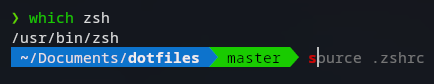

# My Dotfiles 🐚

Scripts for quick installation of Zsh, Oh My Zsh and powerlevel10k theme on Fedora Linux

## How to use
1. Clone repo:
   `git clone https://github.com/sasas991/dotfiles.git`
2. Move to directory:
   `cd dotfiles`
3. Launch script:
   `bash install.sh`

## Content

* Installation: Zsh + Oh My Zsh + powerlevel10k theme on Fedora Linux
* Plugins: zsh-autosuggestions, git, zsh-syntax-highlighting
* Custom aliases